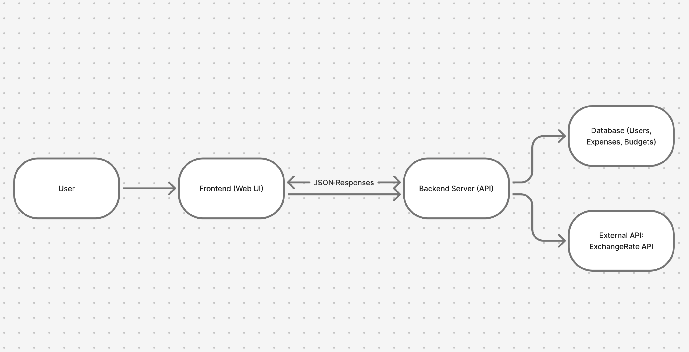

# COP3060Project – The Budgeteers

A semester-long full-stack project focused on building a Student Budget & Expense Tracker.  
This README contains documentation and diagrams required for **Milestone 2**.

---

# 🧭 Project Overview

College students often struggle with budgeting, tracking expenses, and developing good financial habits.  
Our application provides a simple, user-friendly platform for logging expenses, viewing spending trends, and managing budgets manually.

This README includes the **architecture diagram**, **endpoint table**, and **AI usage log**.

---

# 🏗️ System Architecture Diagram

The diagram below shows the high-level structure of the system and how the frontend communicates with the backend:

---

# 🔗 REST API Endpoints (Milestone 2 Prototype)

Below are the current prototype-level endpoints used to demonstrate basic data flow during Milestone 2.

### **Endpoint Table**

| Method | Route | Description | Request Body | Response |
|--------|--------|-------------|--------------|----------|
| GET | `/api/items` | Retrieve all items | None | JSON list of items |
| POST | `/api/items` | Create a new item | `{ "name": "value" }` | JSON of created item |
| DELETE | `/api/items/{id}` | Delete an item by ID | None | `200 OK` or `404 Not Found` |

> These prototype endpoints use simple in-memory storage.  
> Future milestones will replace them with real entities (expenses, budgets) and database logic.

---

# 📂 Project Structure

/docs → proposal, diagrams
/frontend → (Milestone 3+)
/backend → Spring Boot API (Milestone 2 prototype)
/README.md

---

# 📄 Additional Diagrams

### **Data Flow Diagram**
File included in repo:  
`dataflowdiagram.png`

This diagram illustrates how data moves between the user interface, backend logic, and storage components.

---

# 🤖 AI Usage Log

The full AI Usage Log for Milestone 2 can be found here:  
**[AI Usage Log Document](https://docs.google.com/document/d/1ERMhLrodu2hZ_JIKs2dojBXijRAxVSd1JLkA3o9Tac8/edit?usp=sharing)**
